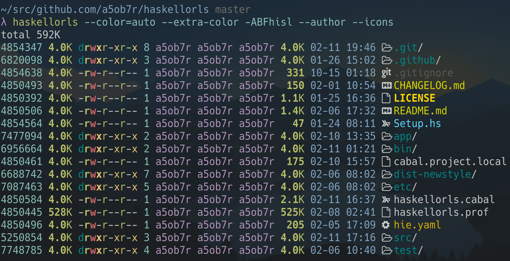
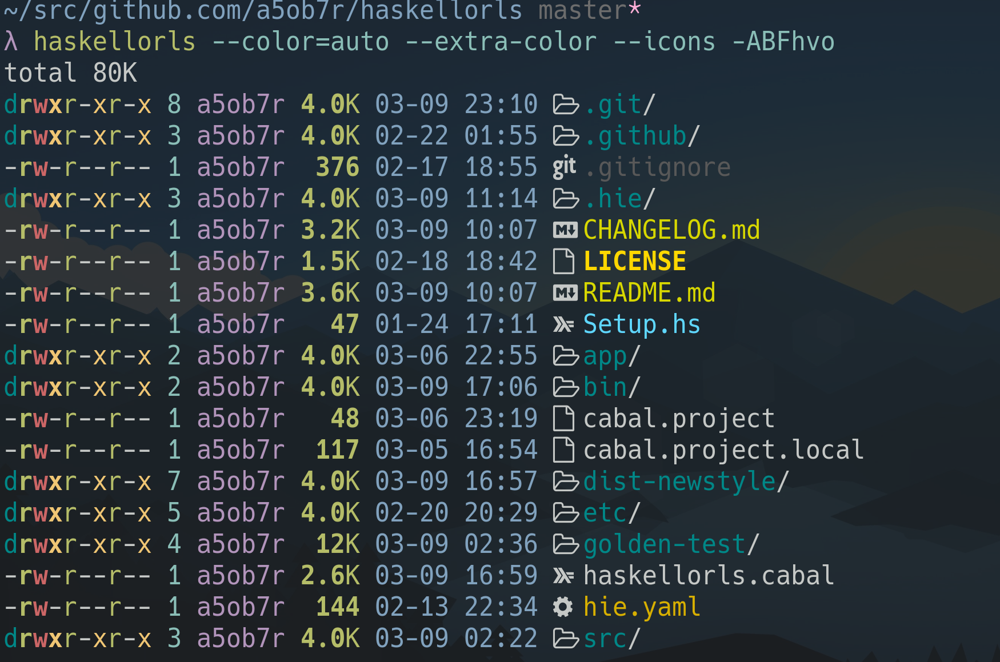

# Haskellorls


[](https://opensource.org/licenses/BSD-3-Clause)

Haskell implementation of ls which is compatible with GNU ls.

`Haskellorls` means Color ls in Haskell.

The goal of this project is to create a software which has GNU ls compatiblities about options and output.
In addition, has some extra options like some ls alternatives or replacements have as long as having above compatiblities.



With [trapd00r/LS_COLORS](https://github.com/trapd00r/LS_COLORS/blob/master/LICENSE)



## Extra Options

Haskellorls has some extra options which are not implemented on GNU ls.

### --extra-color

Enable extra coloring contains file permission, file owner and group and so on.

### --icons

Show file icon before fine name.
Matching algolithm between icons and filenames is same to `LS_COLORS`.

You can configure the rule for matching between filenames and icons via an environment variable `LS_ICONS`. By default, `haskellorls` only has rules for filetypes and no them for filename patterns. See [a5ob7r/LS_ICONS](https://github.com/a5ob7r/LS_ICONS) if you would like to add filename pattern rules or configure them.

### --tree

Output all files using tree style layout.
See `--level=N`.

### --level=N

Restrict max searching depth when output with tree style layout.
Also this can restrict max depth of directory searching using --recursive/-R option.

### --tab-separator

Use tab charactors and some spaces to separate grid divisions when grid layout style; like dir.

## Incompatibilities with GNU ls

This has some imcompatibilities with GNU ls.
To fix them is also the goal of this project.

- Options are parsed as no ordering.
  - `Haskellorls -t -v` and `Haskellorls -v -t` causes same results.
  - It may not be useful to override same category option (e.g. sort options).
- Outputs with the column size which is specified by -w/--width even if output fd is stdout.
- Outputs pico seconds instead of nano seconds after decimal point when uses full-iso as time style format.
  - (nano) 2021-02-19 13:09:58.575236532 +0000
  - (pico) 2021-02-19 13:09:58.575236532000 +0000
- some options which takes string can not recognize shorten string which can be identified using completion.
  - e.g. `--format=WORD`
- Quote a file name or a link name by double quote when the name have tab or newline.

## Config

`Haskellorls` is so long name to type keys.
So recommends to define some aliases to reduce types.

```sh
# In your ~/.bashrc, ~/.zshrc and so on.
alias hl='haskellorls --color=auto --extra-color'
alias l='hl -ABFhvo --icons'
```

If want to use color parameters like exa default,

```sh
$ export EXA_COLORS='ur=1;33:uw=1;31:ux=1;32:ue=1;92:gr=32:gw=31:gx=33:tr=32:tw=31:tx=33:su=96:sf=96:uu=1;33:gu=1;33:'
$ haskellorls --color=auto -l
```

## Install

### Prebuild binary

See [release](https://github.com/a5ob7r/haskellorls/releases) page and download a suitable binary for OS which you use.

### From source

```sh
$ git clone https://github.com/a5ob7r/haskellorls.git
$ cd haskellorls
$ cabal install

# Enable SELinux support
$ cabal configure --flags='selinux'
$ cabal install
```

## Development

Build and run.

```sh
$ cabal run haskellorls
```

Run golden tests using [goldplate](https://github.com/fugue/goldplate).

```sh
# On project root
$ cabal install --overwrite-policy=always --installdir=bin
$ PATH="$PWD/bin:$PATH" goldplate golden-test --pretty-diff
```
