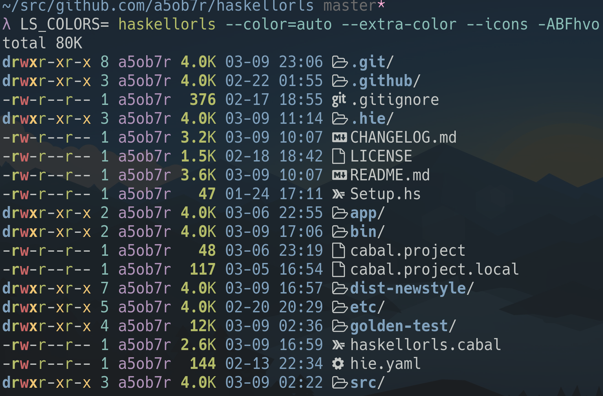

# Haskellorls


Haskell implementation of [exa](https://github.com/ogham/exa) flavored GNU ls.

The goal of this project is to create a software which has GNU ls compatiblities about options and output.
In addition, maybe have some options and colored output which exa has as long as keeping above compatiblities.



## Install

```sh
$ cabal install
```

## Config

If want to use color parameters like exa default,

```sh
$ export EXA_COLORS='ur=1;33:uw=1;31:ux=1;32:ue=1;92:gr=32:gw=31:gx=33:tr=32:tw=31:tx=33:su=96:sf=96:uu=1;33:gu=1;33:'
$ haskellorls --color=auto -l
```

## Development

Build and run.

```sh
$ cabal run haskellorls
```

Run golden tests using [goldplate](https://github.com/fugue/goldplate).

```sh
# On project root
$ cabal install --overwrite-policy=always --installdir=bin
$ PATH="$PWD/bin:$PATH" goldplate golden-test --pretty-diff
```

## Extra Options

Haskellorls has some extra options which are not implemented on GNU ls.

### --extra-color

Enable extra coloring contains file permission, file owner and group and so on.

### --icons

Show file icon before fine name.
Matching algolithm between icons and filenames is same to `LS_COLORS`.

### --tree

Output all files using tree style layout.
See `--level=N`.

### --level=N

Restrict max searching depth when output with tree style layout.
Also this can restrict max depth of directory searching using --recursive/-R option.

## Incompatibilities

### GNU ls

- Options are parsed as no ordering.
  - `Haskellorls -t -v` and `Haskellorls -v -t` causes same results.
  - It may not be useful to override same category option (e.g. sort options).
- Outputs with the column size which is specified by -w/--width even if output fd is stdout.
- Outputs pico seconds instead of nano seconds after decimal point when uses full-iso as time style format.
  - (nano) 2021-02-19 13:09:58.575236532 +0000
  - (pico) 2021-02-19 13:09:58.575236532000 +0000

## TODO

- Add options for compatibility to GNU ls
  - -b, --escape
  - -c
  - -C
  - -d, --directory
  - -D, --dired
  - -f
  - --format=WORD
  - --group-directories-first
  - --hyperlink[=WHEN]
  - -k, --kibibytes
  - -m
  - -N
  - -q
  - --show-control-chars
  - -Q, --quote-name
  - --quoting-style=WORD
  - -T, --tabsize=COLS
  - -u
  - -x
  - -Z, --context
- Add locale support for time style.
- Fix size printer for charactor devices.
- Add an interface model for deriving command parameters from args and options.
- Improve performances.
- Add tests.
  - Unit tests with tasty.
- Register to Hackage.
- Release binary.
- Add --head=N/--tail=N option to restrict max output file numbers.
  - This is useful with --recursive/-R
- etc.

## NOTE

`Haskellorls` means Color ls in Haskell.

This is a joke software created by a beginner.
